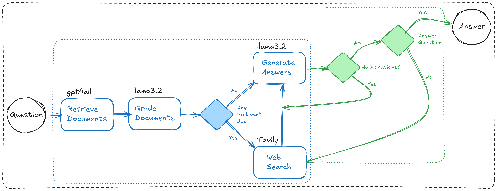

# corrective_rag_ex



## → [LangSmith Dashboard](https://smith.langchain.com/o/2d299bf4-e77a-4c8e-89d0-1eac4a72a727/projects/p/9e5b8c0b-a7b6-4211-9b0a-bbfe9af64a05?timeModel=%7B%22duration%22%3A%227d%22%7D)
## → [FireCrawl Dashboard](https://www.firecrawl.dev/app?authSuccess=true&?status=Success!&status_description=You%20are%20now%20signed%20in.)
## → [Tavily Dashboard](https://app.tavily.com/home)

## run?:
   1. environment setup →
      * to create the virtual environment: ```python -m venv env```
      * to activate the virtual environment: ```.\env\Scripts\activate```
      * to deactivate the virtual environment: ```.\env\Scripts\deactivate```

   2. install dependencies → ```pip install -r requirements.txt```

   3. add the required API keys in `.env.local`, look at `.env.example` for reference 

   note: now just hope everything works (worship to the god you pray)

   4. look for `params.yaml` to change any paths, model names, or data links

   5. `utils/` contains all the common functionality →
      * `config.py` to load parameters from `params.yaml`
      * `logger.py` to setup logger
      * `get_llm_func.py` for embedding, grading, & generation models/functions
      * `get_prompt_temp.py` for grading & generation prompt templates

   6. run pipeline →
      * ```py main.py```
      * with clearing the db: ```py main.py --reset```
      * with scraping for data: ```py main.py --scrape```
      * ```py main.py --scrape --reset```: you know at this point

## Reference:
   * [LangChain → LangGraph RAG Examples](https://github.com/langchain-ai/langgraph/tree/main/examples/rag)
   * [LangGraph Adaptive RAG](https://github.com/langchain-ai/langgraph/blob/main/examples/rag/langgraph_adaptive_rag.ipynb)
   * [LangGraph Adaptive RAG with Local LLMs](https://github.com/langchain-ai/langgraph/blob/main/examples/rag/langgraph_adaptive_rag_local.ipynb)
   * [LangGraph CRAG](https://github.com/langchain-ai/langgraph/blob/main/examples/rag/langgraph_crag.ipynb)
   * [LangGraph CRAG with Local LLMs](https://github.com/langchain-ai/langgraph/blob/main/examples/rag/langgraph_crag_local.ipynb)
   * [AI Engineer (YT): Building Production-Ready RAG Applications: Jerry Liu](https://www.youtube.com/watch?v=TRjq7t2Ms5I)
   * [LlamaIndex](https://github.com/run-llama/llama_cloud_services)
   * [AI Jason (YT): "I want Llama3 to perform 10x with my private knowledge" - Local Agentic RAG w/ llama3](https://www.youtube.com/watch?v=u5Vcrwpzoz8)